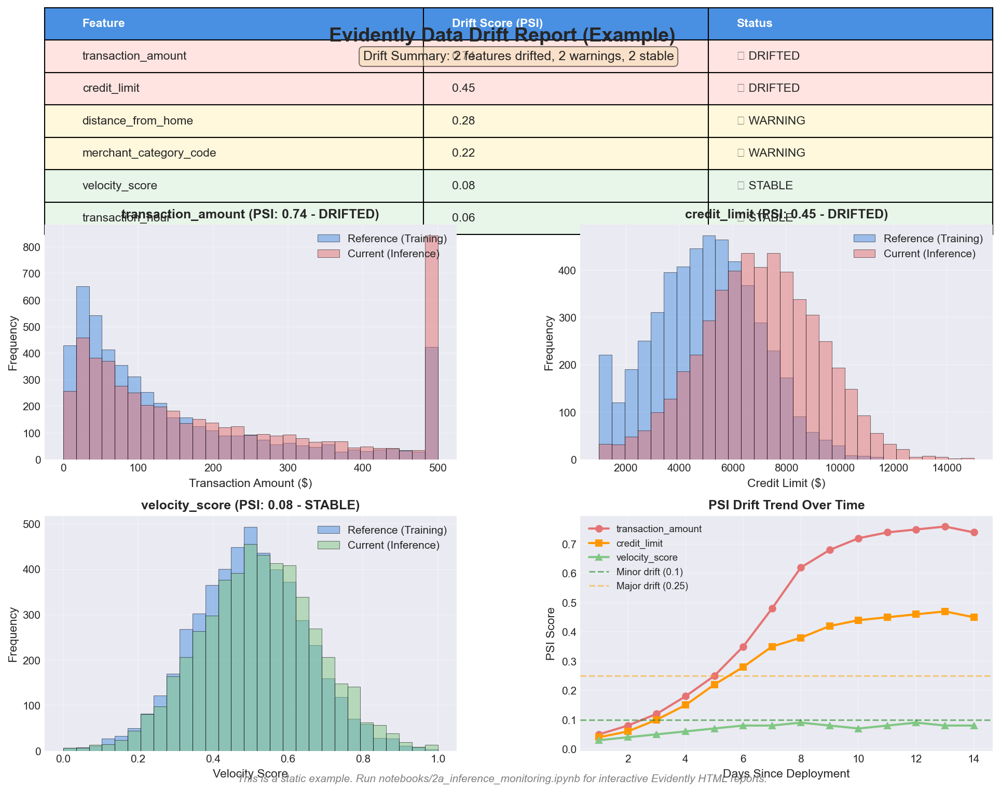
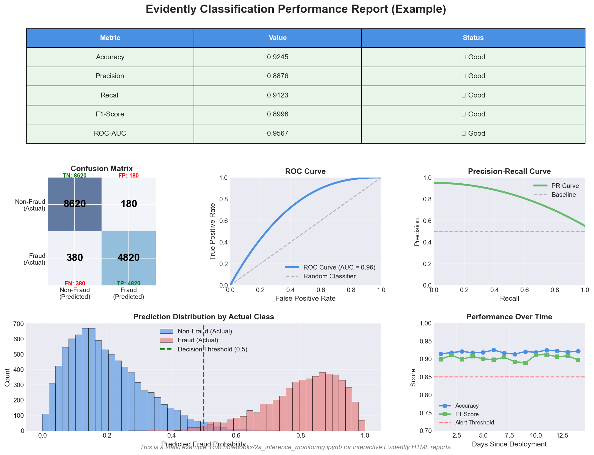

# Evidently Report Screenshots

These are example screenshots showing what Evidently AI drift detection reports look like. When you run `notebooks/2a_inference_monitoring.ipynb` locally, you'll get fully interactive HTML reports with drill-down capabilities.

## Data Drift Report

Shows PSI scores per feature, distribution histograms comparing training vs inference data, and drift trends over time.

## Classification Performance Report

Shows confusion matrix, ROC curve, precision-recall curve, and performance metrics over time.
