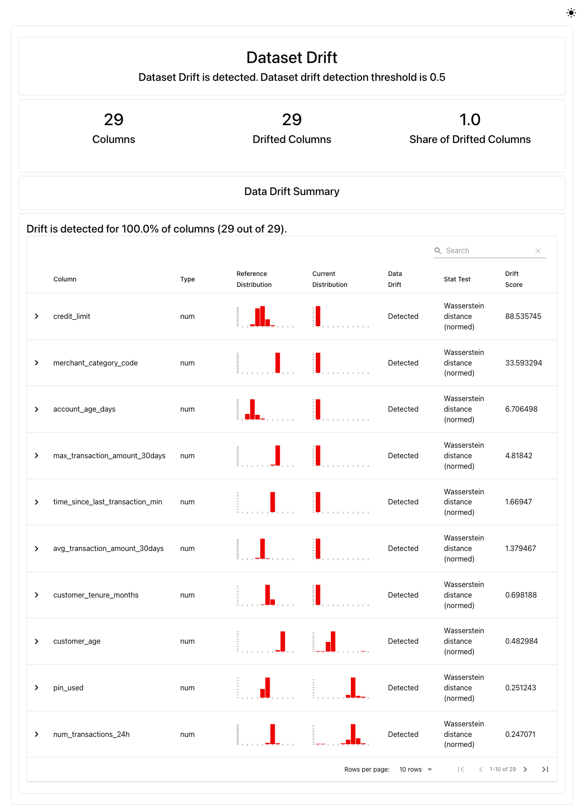
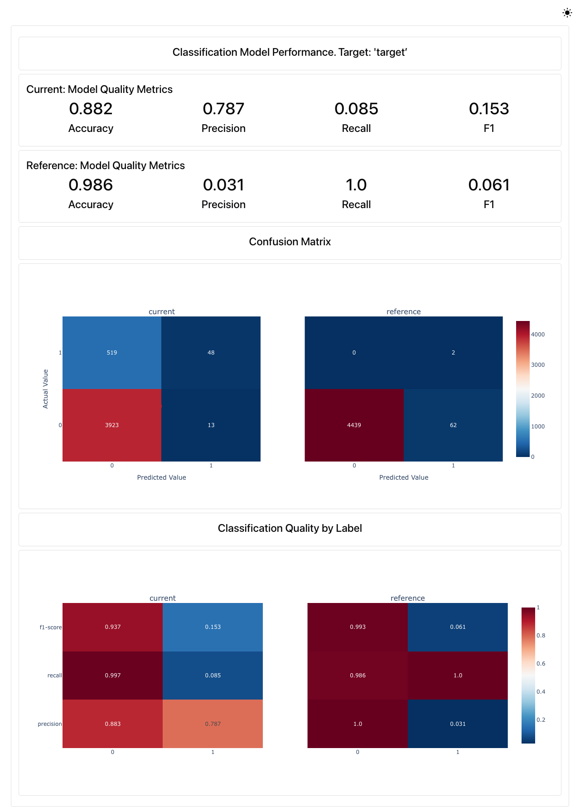

# Evidently Report Screenshots

Screenshots captured from actual Evidently reports logged to MLflow during drift monitoring runs. The full interactive HTML reports are available as MLflow artifacts under `evidently_reports/`.

## Data Drift Report

Shows per-feature drift detection using Wasserstein distance, with reference vs current distribution comparisons.

## Classification Performance Report

Shows model quality metrics (accuracy, precision, recall, F1), confusion matrices, and classification quality by label for current vs reference data.
